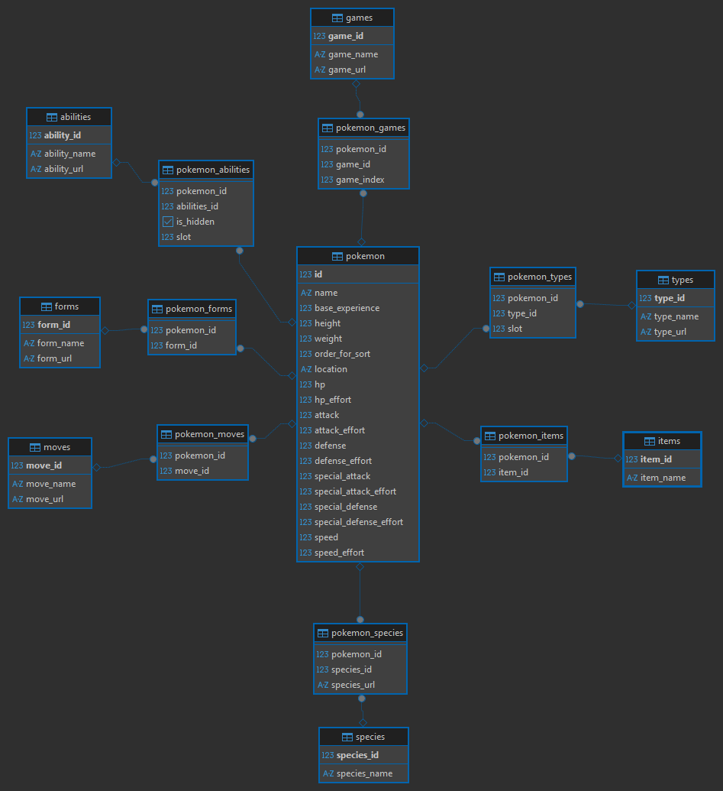

# Pokemon Data Engineering Pipeline ⚡

## Overview

Complete data engineering pipeline that extracts information from PokeAPI and processes it through medallion architecture (bronze/silver/gold). The project implements modern data engineering practices, including dimensional modeling, memory-efficient processing, and Airflow orchestration.

## Key Objectives

- **Layered Architecture**: Implement bronze (raw), silver (cleansed), and gold (dimensional) layers following data lake/warehouse standards
- **Memory-Efficient Processing**: Batch processing to handle large data volumes without memory overflow
- **Dimensional Modeling**: Star schema with fact tables and dimension tables for OLAP analytics
- **Infrastructure as Code**: Fully containerized and reproducible environment
- **Orchestration & Monitoring**: Airflow for scheduling, retry logic, and observability

## Technology Stack

- **Orchestration**: Apache Airflow
- **Processing**: DuckDB, PyArrow, Polars
- **Storage**: MinIO (object storage), PostgreSQL (data warehouse)
- **Containerization**: Docker & Docker Compose
- **Package Manager**: UV (fast Python package installer)
- **Data Format**: Parquet (columnar storage)
- **Source**: PokeAPI REST API

## Architecture

```
┌─────────┐
│ PokeAPI │
└────┬────┘
     │
     ▼
┌──────────────────┐
│  Bronze Layer    │ ← Raw data extraction (JSON → Parquet)
│     MinIO        │
└────┬─────────────┘
     │
     ▼
┌──────────────────┐
│  Silver Layer    │ ← Data cleansing & transformation
│     MinIO        │
└────┬─────────────┘
     │
     ▼
┌──────────────────┐
│   Gold Layer     │ ← Dimensional model (Star Schema)
│   PostgreSQL     │
└──────────────────┘
```

### Dimensional Model Diagram



*The diagram above shows the complete star schema implementation with fact table, dimension tables, and bridge tables for many-to-many relationships.*

## Getting Started

### 1. Prerequisites

```bash
# Requirements
- Docker & Docker Compose
- Git
```

### 2. Clone Repository

```bash
git clone https://github.com/yourusername/pokemon-data-pipeline.git
cd pokemon-data-pipeline
```

### 3. Setup Virtual Environment with UV

```bash
# Create virtual environment and install dependencies
uv venv
source .venv/bin/activate  # Windows: .venv\Scripts\activate

# Install dependencies from pyproject.toml
uv pip install -e .

# Or install from requirements.txt
uv pip install -r requirements.txt

# Add new package 
uv add package-name

# Add new package through pip
uv pip install package-name 

# Sync dependencies (from uv.lock)
uv pip sync
```

**Content of .env.example:**
```bash
AIRFLOW_UID=

# POSTGRES
POSTGRES_USER=
POSTGRES_PASSWORD=
POSTGRES_DB=

# PGADMIN
PGADMIN_DEFAULT_EMAIL=
PGADMIN_DEFAULT_PASSWORD=

# MINIO
AIRFLOW_VAR_MINIO_ROOT_USER= 
AIRFLOW_VAR_MINIO_ROOT_PASSWORD=
```

**Example filled .env:**
```bash
AIRFLOW_UID=50000

# POSTGRES (Airflow Metadata DB)
POSTGRES_USER=airflow
POSTGRES_PASSWORD=airflow_secure_pass
POSTGRES_DB=airflow

# PGADMIN
PGADMIN_DEFAULT_EMAIL=admin@admin.com
PGADMIN_DEFAULT_PASSWORD=admin123

# MINIO
AIRFLOW_VAR_MINIO_ROOT_USER=minioadmin
AIRFLOW_VAR_MINIO_ROOT_PASSWORD=minioadmin123
```

### 4. Start Infrastructure

```bash
# Start all services
docker-compose up -d

# Check container status
docker-compose ps

```

### 5. Access Services

- **Airflow UI**: http://localhost:8080
  - User: `admin`
  - Password: defined in `.env`

- **MinIO Console**: http://localhost:9001
  - User: defined in `.env` (MINIO_ROOT_USER)
  - Password: defined in `.env` (MINIO_ROOT_PASSWORD)

- **PgAdmin**: http://localhost:5050
  - Email: `admin@admin.com`
  - Password: defined in docker-compose

### 6. Run Pipeline

**Via Airflow UI**
- Enable the `poke_api_dag` in the interface
- Manual trigger or wait for schedule

## Project Structure

```
pokemon-data-pipeline/
├── .venv/                         # Virtual environment
├── config/
│   └── airflow.cfg                # Airflow configuration
├── dags/
│   ├── __pycache__/
│   └── poke_api_dag.py            # Main DAG orchestrating the pipeline
├── data/                          # Local data storage 
├── init-scripts/
│   └── SQL/
│       └── DDL/
│           ├── 01-create-db.sql
│           ├── 02-create-schema.sql
│           ├── 03-create-fact-table.sql
│           ├── 04-create-dimesional-tables.sql
│           └── 05-create-bridges-tables.sql
├── logs/                          # Airflow logs
├── pipe/
│   ├── __pycache__/
│   └── utils/
│       └── __init__.py
├── plugins/                       # Airflow plugins
├── .env                           # Environment variables (not in repo)
├── .env.example                   # Environment template
├── .gitignore
├── docker-compose.yaml            # Docker orchestration
├── .python-version                # Python Version
├── dimensional_model              # Star Schema for Gold Layer 
├── Dockerfile                     # Airflow custom image
├── LICENSE
├── pyproject.toml                 # Python project metadata
├── README.md
├── requirements.txt               # Python dependencies
└── uv.lock                        # UV package manager lock file
```

## Database Initialization

The project includes SQL DDL scripts for setting up the gold layer schema in PostgreSQL:

1. **01-create-db.sql**: Creates the database
2. **02-create-schema.sql**: Creates the schema structure
3. **03-create-fact-table.sql**: Creates fact table
4. **04-create-dimesional-tables.sql**: Creates dimension tables
5. **05-create-bridges-tables.sql**: Creates bridge tables for many-to-many relationships

These scripts are located in `init-scripts/SQL/DDL/` and they are executed when the docker compose is activated

## Pipeline Details

### Bronze Layer
- Extraction via PokeAPI with rate limiting
- Batch processing (150 records per batch)
- Intermediate storage in JSON
- Consolidation to Parquet in MinIO
- **Goal**: Raw data ingestion with source fidelity

### Silver Layer
- Read Parquet from MinIO
- Data cleansing and normalization
- Columnar processing with PyArrow/Polars
- Deduplication and validation
- **Goal**: Clean data prepared for modeling

### Gold Layer
- Dimensional modeling (star schema)
- Load into PostgreSQL
- Constraints and indexes for performance
- Bridge tables for N:N relationships
- **Goal**: Analytics-ready data warehouse

## Key Learnings & Best Practices

### Memory Management
- ✅ Batch processing prevents OOM errors
- ✅ Staging in object storage before consolidation
- ✅ Release memory immediately after processing

### Architecture Decisions
- ✅ DuckDB for local processing, PostgreSQL for warehouse
- ✅ Parquet for efficient storage (compression + columnar)
- ✅ Clear separation between layers (bronze/silver/gold)

### Docker & Infrastructure
- ✅ Remove volumes when changing credentials
- ✅ Container-to-container communication uses service names
- ✅ Secrets in `.env`, never in code

### Data Modeling
- ✅ Star schema facilitates analytical queries
- ✅ Bridge tables for many-to-many relationships
- ✅ Surrogate keys for dimensions

## Contribution Guidelines

1. Fork the repository
2. Create a branch (`git checkout -b feature/new-feature`)
3. Commit your changes (`git commit -m 'Add: new feature'`)
4. Push to the branch (`git push origin feature/new-feature`)
5. Open a Pull Request

## Don't stray from the path to the dark side:

<div align="center">  
  
</div>

## References

- [PokeAPI Documentation](https://pokeapi.co/docs/v2)
- [Apache Airflow Docs](https://airflow.apache.org/docs/)
- [DuckDB Documentation](https://duckdb.org/docs/)
- [UV - Fast Python Package Installer](https://github.com/astral-sh/uv)

## **Contact:**  
If you have any questions or issues, feel free to contact:  
📧 Email: **davicc@outlook.com.br**  

## **Sith Lords Responsible for the Project:**  
- **Darth Davi** ⚔️😡  

## **Mentor Who Proposed the Challenge:**  
[Prof. Artemisia Weyl](https://www.linkedin.com/in/arteweyl/)  

👩‍💻 Mentor’s GitHub: [https://github.com/arteweyl](https://github.com/arteweyl)  

*Through victory, my chains are broken.  
The Force shall free me.*